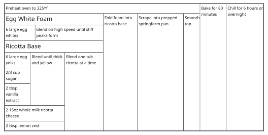

# @wendall911/recipe-grid

Write a recipe as markdown; get back a structured flexbox card and a headless stylesheet. Accessibility-first, mobile-first, headless, framework-agnostic. ESM, typed.

A recipe card is the card you lay on the counter and cook from: one recipe, whole, readable at a glance. The markdown is that recipe, readable on its own and editable by hand, and the card is drawn from it.

Rendered card without title and description:



```
---
scalingType: fixed
slug: cheesecake
---
Classic Ricotta Cheesecake
====

Classic cheesecake recipe shared from a friend who worked in NYC as a head chef.

This recipe is best with a springform pan. Line bottom of springform pan with parchment paper. Whites and yolks need separated ahead of time. If using a blender to mix main ingredients, just drop separated yolks into the blender.

    6 large egg whites
    6 large egg yolks
    2/3 cup sugar
    2 tbsp vanilla extract
    2 '15oz whole milk ricotta cheese'
    2 tbsp lemon zest

    Egg White Foam := blend on high speed until stiff peaks form(
        egg whites
    )

    Ricotta Base := Blend one tub ricotta at a time(
        Blend until thick and yellow(
            egg yolks,
            sugar,
            vanilla extract,
        ),
        '15oz whole milk ricotta cheese',
        lemon zest
    )

    Chill for 6 hours or overnight (
        Bake for 80 minutes (
            Preheat oven to 325*f,
            Smooth top(
                Scrape into prepped springform pan(
                    Fold foam into ricotta base(
                        Egg White Foam,
                        Ricotta Base
                    )
                )
            ),
        )
    )
```

## API

`parse` takes the markdown and returns the card in the forms a consumer needs:

- **`structure`** -- the render structure a framework binding walks, one node at a time. Each node carries a part marker, the semantic tag it renders as, and the data a consumer computes with: a scalable value, a unit key, a target slug.
- **`root`** -- that same structure as elements, a serialisable DOM chunk to mount directly.
- **`meta`** -- the recipe's own metadata: its slug, and how it scales.
- **`title`** and **`description`** -- the human-facing header.

The data bindings are what a consumer computes with. A quantity carries its unit as a key from [`parse-ingredient`](https://www.npmjs.com/package/parse-ingredient) ([source](https://github.com/jakeboone02/parse-ingredient)), whose vocabulary is also the grammar's, so its `convertUnit` takes the key directly. A scalable value carries its base amount, and the recipe carries how it scales, when the author declared that it does. The card renders the same whether or not a consumer reaches for either.

The headless stylesheet ships alongside. It is flow only -- which way a box lays its children out and how it takes space from its parent -- so the card lays out correctly on a phone before a theme touches it. Colors, borders, spacing, and type are yours.

Two properties hold across all of it.

**The grammar is the gate.** A body reads as a valid Directed Acyclic Graph or the document is broken: `parse` throws `RecipeParseError` and there is one place to catch it. Whether a well-formed recipe is a *sensible* recipe -- every ingredient reached, no hanging nodes -- is a separate question, asked off the render path.

**Nothing is discarded.** Each form adds; none rewrites. `1/2` stays an exact fraction and `0.5` stays a decimal though both are the same magnitude; a quantity keeps the whitespace between its value and its unit; a quoted description keeps its parens and commas verbatim. Where a canonical handle is useful -- a unit key, a target slug, a base value to scale from -- it rides alongside what the author wrote rather than replacing it. The card carries back to the markdown it came from, which is what makes the format archival.

## Integration

A framework binding is the usual entry. [`@wendall911/recipe-grid-svelte`](https://www.npmjs.com/package/@wendall911/recipe-grid-svelte) renders the card as Svelte components; this package is what it compiles with. A consumer without a framework mounts the DOM chunk this package returns.

## Documentation

See: [`docs/`](./docs).

## License

AGPL-3.0-or-later.
